# DataFlow 前端数据流文档

本文档基于实际代码实现，详细描述 DataFlow 前端应用中的三大核心数据流：**用户认证**、**数据库连接**和**数据表视图**。

---

## 目录

1. [系统架构概览](#1-系统架构概览)
2. [用户认证 (Authentication)](#2-用户认证-authentication)
3. [数据库连接 (Database Connection)](#3-数据库连接-database-connection)
4. [数据表视图 (Table View)](#4-数据表视图-table-view)
5. [关键文件索引](#5-关键文件索引)

---

## 1. 系统架构概览

DataFlow 是 WhoDB 的前端 SPA，使用 Vite + React 19 + TypeScript 构建，通过 Apollo Client 与 Go 后端的 GraphQL API 通信。

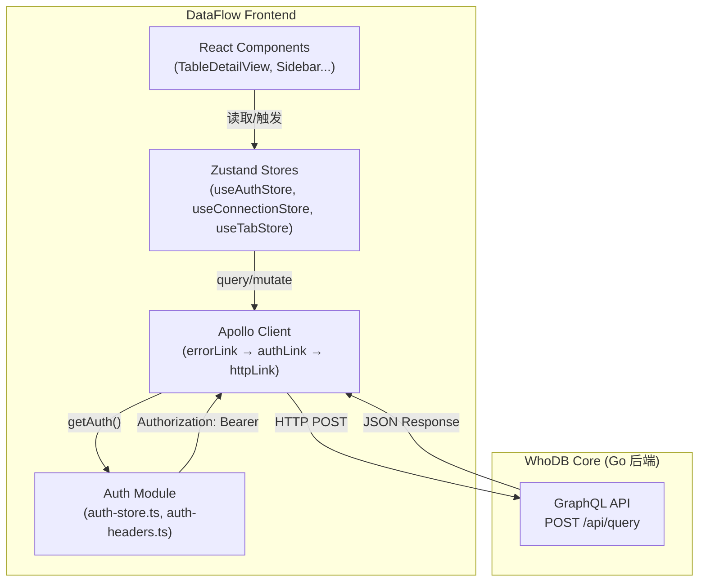
```mermaid
graph TB
    subgraph "DataFlow Frontend"
        UI["React Components<br/>(TableDetailView, Sidebar...)"]
        ZS["Zustand Stores<br/>(useAuthStore, useConnectionStore, useTabStore)"]
        AC["Apollo Client<br/>(errorLink → authLink → httpLink)"]
        AM["Auth Module<br/>(auth-store.ts, auth-headers.ts)"]
    end

    subgraph "WhoDB Core (Go 后端)"
        API["GraphQL API<br/>POST /api/query"]
    end

    UI -->|"读取/触发"| ZS
    ZS -->|"query/mutate"| AC
    AC -->|"getAuth()"| AM
    AM -->|"Authorization: Bearer"| AC
    AC -->|"HTTP POST"| API
    API -->|"JSON Response"| AC
```

### 前端技术栈

| 模块 | 技术 |
|------|------|
| 框架 | React 19 + TypeScript 5 |
| 状态管理 | Zustand |
| GraphQL | Apollo Client |
| 样式 | Tailwind CSS 4 |
| 构建 | Vite 7 (dev 端口 3000, proxy → 后端 8080) |
| SQL 编辑器 | Monaco Editor |
| 图表 | ECharts |
| 表格导出 | xlsx |

### 前端目录结构

```
src/
├── config/                 # 基础设施配置
│   ├── graphql-client.ts   # Apollo Client (Link Chain)
│   ├── auth-store.ts       # 模块级凭据存储 + sessionStorage
│   ├── auth-headers.ts     # Authorization Header 构建
│   └── sealos.ts           # Sealos 集成 (类型映射, AES 解密)
├── stores/                 # Zustand 状态管理
│   ├── useAuthStore.ts     # 认证生命周期
│   ├── useConnectionStore.ts # 连接 + DB/Schema/Table 查询
│   ├── useTabStore.ts      # 标签页管理
│   └── useAnalysisStore.ts # 仪表盘状态 (内存)
├── components/
│   ├── layout/             # MainLayout, ActivityBar, Sidebar, TabBar
│   ├── database/           # TableDetailView, FilterTableModal, ExportDataModal...
│   ├── editor/             # SQL Editor (Monaco)
│   ├── analysis/           # Dashboard Builder
│   └── ui/                 # Button, Input, Modal, Badge...
├── graphql/                # .graphql 文件 (queries + mutations)
├── generated/              # GraphQL codegen 输出
├── utils/                  # search-parser, graphql-transforms, database-features
└── main.tsx                # 入口
```

---

## 2. 用户认证 (Authentication)

### 2.1 认证全流程

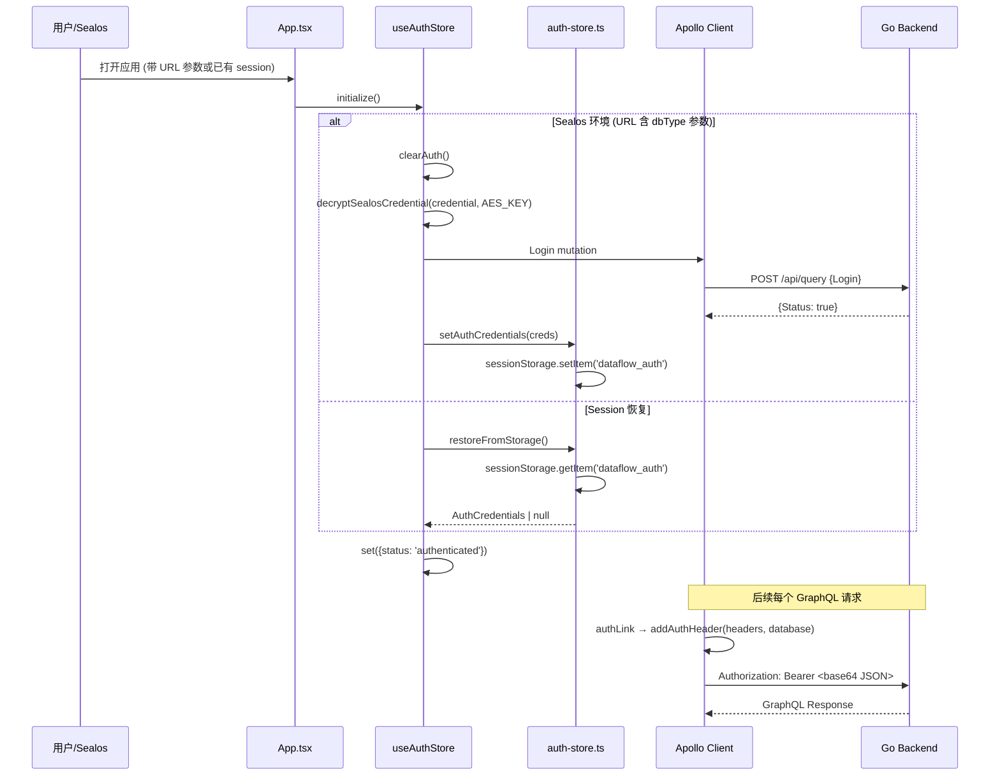
```mermaid
sequenceDiagram
    participant User as 用户/Sealos
    participant App as App.tsx
    participant AuthStore as useAuthStore
    participant AuthMod as auth-store.ts
    participant Apollo as Apollo Client
    participant Backend as Go Backend

    User->>App: 打开应用 (带 URL 参数或已有 session)
    App->>AuthStore: initialize()

    alt Sealos 环境 (URL 含 dbType 参数)
        AuthStore->>AuthStore: clearAuth()
        AuthStore->>AuthStore: decryptSealosCredential(credential, AES_KEY)
        AuthStore->>Apollo: Login mutation
        Apollo->>Backend: POST /api/query {Login}
        Backend-->>Apollo: {Status: true}
        AuthStore->>AuthMod: setAuthCredentials(creds)
        AuthMod->>AuthMod: sessionStorage.setItem('dataflow_auth')
    else Session 恢复
        AuthStore->>AuthMod: restoreFromStorage()
        AuthMod->>AuthMod: sessionStorage.getItem('dataflow_auth')
        AuthMod-->>AuthStore: AuthCredentials | null
    end

    AuthStore->>AuthStore: set({status: 'authenticated'})

    Note over Apollo,Backend: 后续每个 GraphQL 请求
    Apollo->>Apollo: authLink → addAuthHeader(headers, database)
    Apollo->>Backend: Authorization: Bearer <base64 JSON>
    Backend-->>Apollo: GraphQL Response
```

### 2.2 Sealos 登录流程

DataFlow 运行在 Sealos 云平台中，通过 URL 参数接收加密的数据库凭据。

来源: `src/stores/useAuthStore.ts`

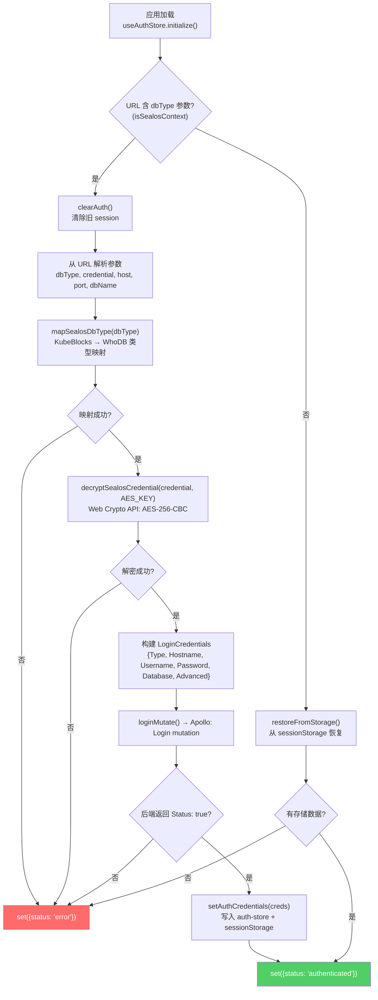
```mermaid
flowchart TD
    A["应用加载<br/>useAuthStore.initialize()"] --> B{"URL 含 dbType 参数?<br/>(isSealosContext)"}
    B -->|是| C["clearAuth()<br/>清除旧 session"]
    C --> D["从 URL 解析参数<br/>dbType, credential, host, port, dbName"]
    D --> E["mapSealosDbType(dbType)<br/>KubeBlocks → WhoDB 类型映射"]
    E --> F{"映射成功?"}
    F -->|否| ERR["set({status: 'error'})"]
    F -->|是| G["decryptSealosCredential(credential, AES_KEY)<br/>Web Crypto API: AES-256-CBC"]
    G --> H{"解密成功?"}
    H -->|否| ERR
    H -->|是| I["构建 LoginCredentials<br/>{Type, Hostname, Username, Password, Database, Advanced}"]
    I --> J["loginMutate() → Apollo: Login mutation"]
    J --> K{"后端返回 Status: true?"}
    K -->|否| ERR
    K -->|是| L["setAuthCredentials(creds)<br/>写入 auth-store + sessionStorage"]
    L --> OK["set({status: 'authenticated'})"]

    B -->|否| M["restoreFromStorage()<br/>从 sessionStorage 恢复"]
    M --> N{"有存储数据?"}
    N -->|是| OK
    N -->|否| ERR

    style ERR fill:#ff6b6b,color:#fff
    style OK fill:#51cf66,color:#fff
```

#### Sealos URL 参数

| 参数 | 说明 | 示例 |
|------|------|------|
| `dbType` | KubeBlocks 数据库类型 | `postgresql`, `apecloud-mysql`, `mongodb` |
| `credential` | AES-256-CBC 加密的凭据 (base64) | `base64(IV_16bytes + ciphertext)` |
| `host` | 数据库主机地址 | `pg-master.ns-xxx.svc` |
| `port` | 端口号 | `5432` |
| `dbName` | 数据库名 (可选，有默认值) | `mydb` |

#### KubeBlocks → WhoDB 类型映射

来源: `src/config/sealos.ts`

| KubeBlocks dbType | WhoDB Type | 默认数据库 |
|-------------------|------------|-----------|
| `postgresql` | `Postgres` | `postgres` |
| `apecloud-mysql` | `MySQL` | (空) |
| `mongodb` | `MongoDB` | `admin` |
| `redis` | `Redis` | (空) |
| `clickhouse` | `ClickHouse` | `default` |

#### AES 解密流程

来源: `src/config/sealos.ts` — `decryptSealosCredential()`

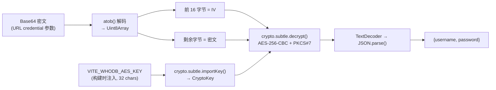
```mermaid
flowchart LR
    A["Base64 密文<br/>(URL credential 参数)"] --> B["atob() 解码<br/>→ Uint8Array"]
    B --> C["前 16 字节 = IV"]
    B --> D["剩余字节 = 密文"]
    E["VITE_WHODB_AES_KEY<br/>(构建时注入, 32 chars)"] --> F["crypto.subtle.importKey()<br/>→ CryptoKey"]
    C --> G["crypto.subtle.decrypt()<br/>AES-256-CBC + PKCS#7"]
    D --> G
    F --> G
    G --> H["TextDecoder → JSON.parse()"]
    H --> I["{username, password}"]
```

### 2.3 凭据存储架构 (两层设计)

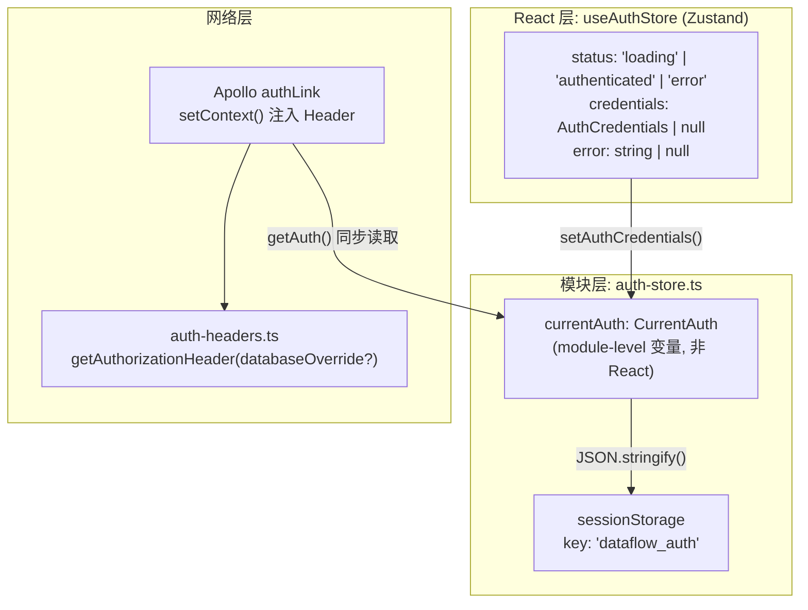
```mermaid
graph TB
    subgraph "React 层: useAuthStore (Zustand)"
        ZS["status: 'loading' | 'authenticated' | 'error'<br/>credentials: AuthCredentials | null<br/>error: string | null"]
    end

    subgraph "模块层: auth-store.ts"
        MA["currentAuth: CurrentAuth<br/>(module-level 变量, 非 React)"]
        SS["sessionStorage<br/>key: 'dataflow_auth'"]
    end

    subgraph "网络层"
        AH["auth-headers.ts<br/>getAuthorizationHeader(databaseOverride?)"]
        AL["Apollo authLink<br/>setContext() 注入 Header"]
    end

    ZS -->|"setAuthCredentials()"| MA
    MA -->|"JSON.stringify()"| SS
    AL -->|"getAuth() 同步读取"| MA
    AL --> AH
```

**为什么需要两层?**

Apollo Client 的 `authLink` 在 React 组件树外运行，需要**同步**访问当前凭据。`auth-store.ts` 作为独立模块，通过 `let currentAuth` 变量提供同步读取，不依赖 React 生命周期。

来源: `src/config/auth-store.ts`

```typescript
type CurrentAuth =
  | { kind: 'inline'; credentials: AuthCredentials }   // Sealos 登录 (完整凭据)
  | { kind: 'profile'; profile: SavedProfileCredentials } // 保存的配置文件
  | null;

let currentAuth: CurrentAuth = null;  // 模块级变量

// 写入: Zustand store 调用
export function setAuthCredentials(creds: AuthCredentials): void {
  currentAuth = { kind: 'inline', credentials: creds };
  sessionStorage.setItem('dataflow_auth', JSON.stringify(creds));
}

// 读取: Apollo authLink 调用
export function getAuth(): CurrentAuth {
  return currentAuth;
}
```

### 2.4 Authorization Header 构建

来源: `src/config/auth-headers.ts`

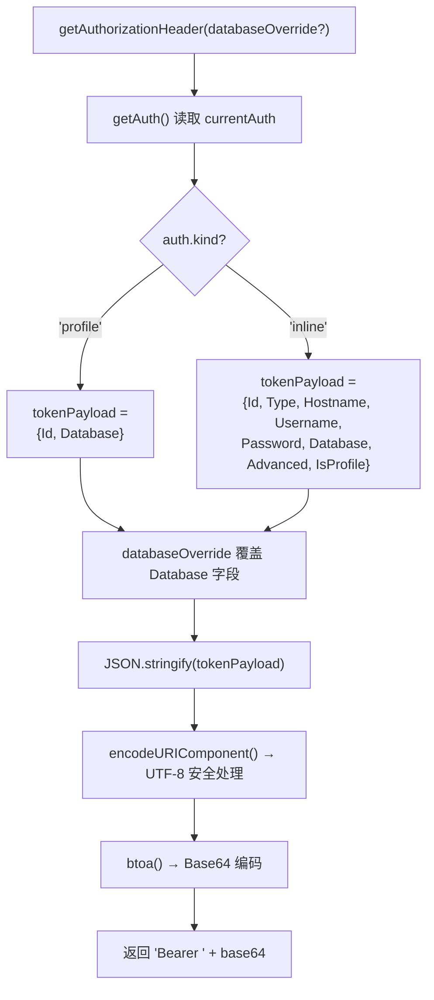
```mermaid
flowchart TD
    A["getAuthorizationHeader(databaseOverride?)"] --> B["getAuth() 读取 currentAuth"]
    B --> C{"auth.kind?"}

    C -->|"'profile'"| D["tokenPayload =<br/>{Id, Database}"]
    C -->|"'inline'"| E["tokenPayload =<br/>{Id, Type, Hostname, Username,<br/>Password, Database, Advanced, IsProfile}"]

    D --> F["databaseOverride 覆盖 Database 字段"]
    E --> F
    F --> G["JSON.stringify(tokenPayload)"]
    G --> H["encodeURIComponent() → UTF-8 安全处理"]
    H --> I["btoa() → Base64 编码"]
    I --> J["返回 'Bearer ' + base64"]
```

**为什么用 Authorization Header 而非 Cookie?**
- Cookie 有 ~4KB 限制，SSL 证书在 `Advanced` 字段中可能超限
- 浏览器静默丢弃超大 Cookie → 无声认证失败
- Header 无实际大小限制

### 2.5 Apollo Client Link Chain

来源: `src/config/graphql-client.ts`

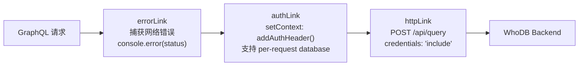
```mermaid
flowchart LR
    REQ["GraphQL 请求"] --> EL["errorLink<br/>捕获网络错误<br/>console.error(status)"]
    EL --> AL["authLink<br/>setContext: addAuthHeader()<br/>支持 per-request database"]
    AL --> HL["httpLink<br/>POST /api/query<br/>credentials: 'include'"]
    HL --> API["WhoDB Backend"]
```

关键设计: `authLink` 从 Apollo operation context 读取 `database` 字段，实现**每请求数据库切换**：

```typescript
const authLink = setContext((_, previousContext) => ({
  headers: addAuthHeader(
    previousContext.headers,
    previousContext.database,  // 可选: 覆盖默认数据库
  ),
}));
```

### 2.6 后端认证 (简述)

后端 `AuthMiddleware` (`core/src/auth/auth.go`) 对每个非公开请求：
1. 从 `Authorization: Bearer <token>` 提取 token
2. Base64 解码 → JSON 反序列化 → `engine.Credentials`
3. 将凭据注入 `context.WithValue(ctx, Credentials)` 供 Resolver 使用

公开路由 (无需认证): `Login`, `LoginWithProfile`, `GetProfiles`, `GetVersion` 等。

---

## 3. 数据库连接 (Database Connection)

### 3.1 前端连接管理

来源: `src/stores/useConnectionStore.ts`

DataFlow 在 Sealos 模式下运行，连接由认证凭据**自动派生**，无需用户手动管理。

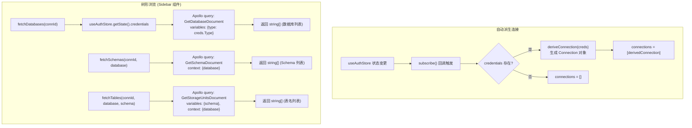
```mermaid
flowchart TD
    subgraph "自动派生连接"
        A["useAuthStore 状态变更"] --> B["subscribe() 回调触发"]
        B --> C{"credentials 存在?"}
        C -->|是| D["deriveConnection(creds)<br/>生成 Connection 对象"]
        C -->|否| E["connections = []"]
        D --> F["connections = [derivedConnection]"]
    end

    subgraph "树形浏览 (Sidebar 组件)"
        G["fetchDatabases(connId)"] --> H["useAuthStore.getState().credentials"]
        H --> I["Apollo query: GetDatabaseDocument<br/>variables: {type: creds.Type}"]
        I --> J["返回 string[] (数据库列表)"]

        K["fetchSchemas(connId, database)"] --> L["Apollo query: GetSchemaDocument<br/>context: {database}"]
        L --> M["返回 string[] (Schema 列表)"]

        N["fetchTables(connId, database, schema)"] --> O["Apollo query: GetStorageUnitsDocument<br/>variables: {schema}, context: {database}"]
        O --> P["返回 string[] (表名列表)"]
    end
```

#### Connection 派生逻辑

```typescript
function deriveConnection(creds: AuthCredentials, createdAt: string): Connection {
  return {
    id: 'sealos',                             // 固定 ID
    name: `${creds.Type} @ ${creds.Hostname}`, // 显示名称
    type: connectionTypeMap[creds.Type],        // 'POSTGRES' | 'MYSQL' | ...
    host: creds.Hostname,
    port: creds.Advanced?.find(a => a.Key === 'Port')?.Value ?? '',
    user: creds.Username,
    password: creds.Password,
    database: creds.Database,
    createdAt,
  };
}
```

#### CRUD 操作存根

当前 `createDatabase`, `updateDatabase`, `deleteDatabase`, `createTable` 等方法为存根，待后续集成：

```typescript
createDatabase: async () => { console.warn('pending Phase 4 GraphQL wiring'); return false; },
```

### 3.2 每请求数据库上下文

Apollo `authLink` 支持通过 `context.database` 在**单次请求**中指定不同的目标数据库，无需修改全局认证状态。

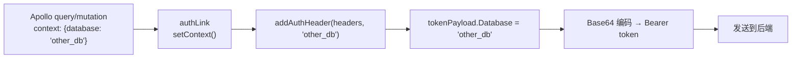
```mermaid
flowchart LR
    A["Apollo query/mutation<br/>context: {database: 'other_db'}"] --> B["authLink<br/>setContext()"]
    B --> C["addAuthHeader(headers, 'other_db')"]
    C --> D["tokenPayload.Database = 'other_db'"]
    D --> E["Base64 编码 → Bearer token"]
    E --> F["发送到后端"]
```

使用示例:

```typescript
// 查询 'analytics' 数据库的 schema (而非默认数据库)
const { data } = await graphqlClient.query<GetSchemaQuery>({
  query: GetSchemaDocument,
  context: { database: 'analytics' },
});
```

### 3.3 Sidebar 树形浏览数据流

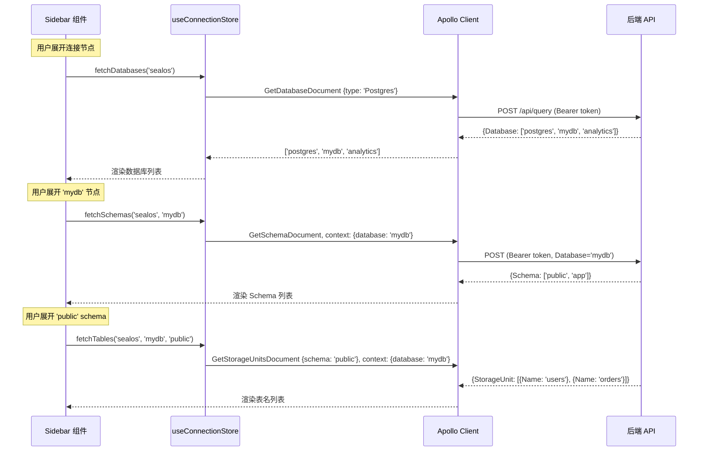
```mermaid
sequenceDiagram
    participant Sidebar as Sidebar 组件
    participant CS as useConnectionStore
    participant Apollo as Apollo Client
    participant API as 后端 API

    Note over Sidebar: 用户展开连接节点
    Sidebar->>CS: fetchDatabases('sealos')
    CS->>Apollo: GetDatabaseDocument {type: 'Postgres'}
    Apollo->>API: POST /api/query (Bearer token)
    API-->>Apollo: {Database: ['postgres', 'mydb', 'analytics']}
    Apollo-->>CS: ['postgres', 'mydb', 'analytics']
    CS-->>Sidebar: 渲染数据库列表

    Note over Sidebar: 用户展开 'mydb' 节点
    Sidebar->>CS: fetchSchemas('sealos', 'mydb')
    CS->>Apollo: GetSchemaDocument, context: {database: 'mydb'}
    Apollo->>API: POST (Bearer token, Database='mydb')
    API-->>Apollo: {Schema: ['public', 'app']}
    Apollo-->>Sidebar: 渲染 Schema 列表

    Note over Sidebar: 用户展开 'public' schema
    Sidebar->>CS: fetchTables('sealos', 'mydb', 'public')
    CS->>Apollo: GetStorageUnitsDocument {schema: 'public'}, context: {database: 'mydb'}
    API-->>Apollo: {StorageUnit: [{Name: 'users'}, {Name: 'orders'}]}
    Apollo-->>Sidebar: 渲染表名列表
```

### 3.4 标签页管理

来源: `src/stores/useTabStore.ts`

用户点击表名时，打开一个数据表标签页。标签页去重：同一表不会重复打开。

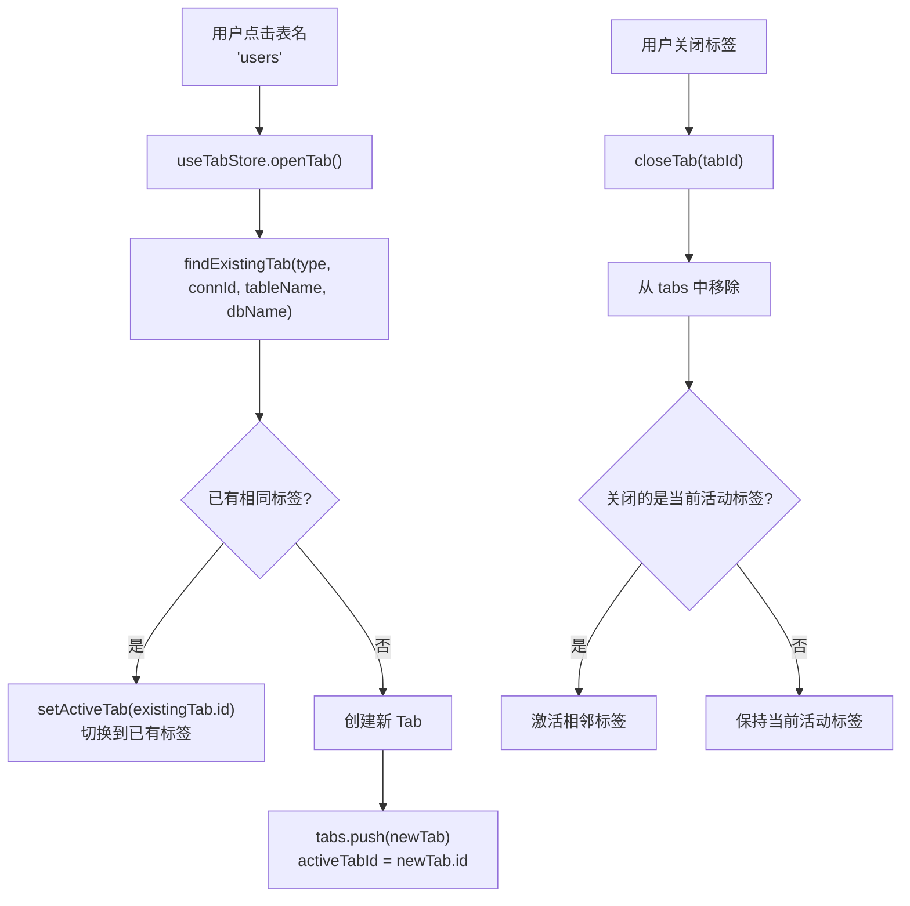
```mermaid
flowchart TD
    A["用户点击表名<br/>'users'"] --> B["useTabStore.openTab()"]
    B --> C["findExistingTab(type, connId, tableName, dbName)"]
    C --> D{"已有相同标签?"}
    D -->|是| E["setActiveTab(existingTab.id)<br/>切换到已有标签"]
    D -->|否| F["创建新 Tab"]
    F --> G["tabs.push(newTab)<br/>activeTabId = newTab.id"]

    H["用户关闭标签"] --> I["closeTab(tabId)"]
    I --> J["从 tabs 中移除"]
    J --> K{"关闭的是当前活动标签?"}
    K -->|是| L["激活相邻标签"]
    K -->|否| M["保持当前活动标签"]
```

Tab 数据结构:

```typescript
interface Tab {
  id: string;            // 'tab_1711234567_abc123'
  type: TabType;         // 'query' | 'table' | 'collection' | 'redis_keys_list'
  title: string;         // 显示标题
  connectionId: string;  // 'sealos'
  databaseName?: string; // 当前数据库
  schemaName?: string;   // 当前 schema
  tableName?: string;    // 表名 (type='table' 时)
  sqlContent?: string;   // SQL 内容 (type='query' 时)
  isDirty?: boolean;     // 未保存状态
}
```

### 3.5 后端连接 (简述)

后端收到请求后，通过插件架构连接数据库：
- `GetPluginForContext(ctx)` 从上下文读取凭据 → 选择对应数据库插件 (Postgres/MySQL/MongoDB...)
- `WithConnection(config, db, operation)` 管理连接缓存 (SHA256 key, TTL 5分钟, 最大 50 个, Ping 验证)
- 所有数据库操作通过 `PluginFunctions` 接口统一抽象

---

## 4. 数据表视图 (Table View)

### 4.1 组件结构与状态

来源: `src/components/database/TableDetailView.tsx`

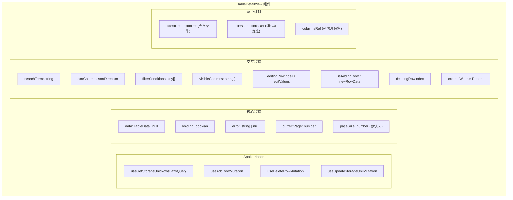
```mermaid
flowchart TD
    subgraph "TableDetailView 组件"
        subgraph "Apollo Hooks"
            GR["useGetStorageUnitRowsLazyQuery"]
            AR["useAddRowMutation"]
            DR["useDeleteRowMutation"]
            UR["useUpdateStorageUnitMutation"]
        end

        subgraph "核心状态"
            DATA["data: TableData | null"]
            LOAD["loading: boolean"]
            ERR["error: string | null"]
            PAGE["currentPage: number"]
            PS["pageSize: number (默认50)"]
        end

        subgraph "交互状态"
            SEARCH["searchTerm: string"]
            SORT["sortColumn / sortDirection"]
            FILTER["filterConditions: any[]"]
            COLS["visibleColumns: string[]"]
            EDIT["editingRowIndex / editValues"]
            ADD["isAddingRow / newRowData"]
            DEL["deletingRowIndex"]
            CW["columnWidths: Record<string, number>"]
        end

        subgraph "防护机制"
            RID["latestRequestIdRef (竞态条件)"]
            FREF["filterConditionsRef (闭包稳定性)"]
            CREF["columnsRef (列信息保留)"]
        end
    end
```

### 4.2 数据加载流程

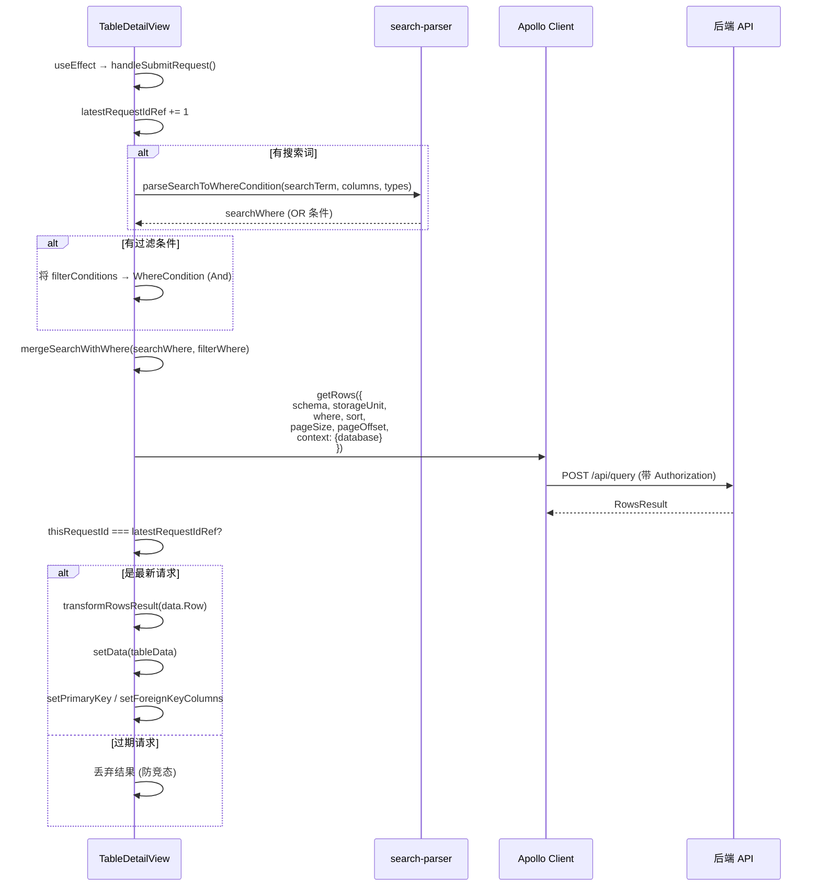
```mermaid
sequenceDiagram
    participant TV as TableDetailView
    participant Parser as search-parser
    participant Apollo as Apollo Client
    participant API as 后端 API

    TV->>TV: useEffect → handleSubmitRequest()
    TV->>TV: latestRequestIdRef += 1

    alt 有搜索词
        TV->>Parser: parseSearchToWhereCondition(searchTerm, columns, types)
        Parser-->>TV: searchWhere (OR 条件)
    end

    alt 有过滤条件
        TV->>TV: 将 filterConditions → WhereCondition (And)
    end

    TV->>TV: mergeSearchWithWhere(searchWhere, filterWhere)

    TV->>Apollo: getRows({<br/>  schema, storageUnit,<br/>  where, sort,<br/>  pageSize, pageOffset,<br/>  context: {database}<br/>})

    Apollo->>API: POST /api/query (带 Authorization)
    API-->>Apollo: RowsResult

    TV->>TV: thisRequestId === latestRequestIdRef?
    alt 是最新请求
        TV->>TV: transformRowsResult(data.Row)
        TV->>TV: setData(tableData)
        TV->>TV: setPrimaryKey / setForeignKeyColumns
    else 过期请求
        TV->>TV: 丢弃结果 (防竞态)
    end
```

### 4.3 GraphQL 查询与响应

**Query:**

```graphql
query GetStorageUnitRows(
  $schema: String!
  $storageUnit: String!
  $where: WhereCondition
  $sort: [SortCondition!]
  $pageSize: Int!
  $pageOffset: Int!
) {
  Row(schema: $schema, storageUnit: $storageUnit,
      where: $where, sort: $sort,
      pageSize: $pageSize, pageOffset: $pageOffset) {
    Columns { Type, Name, IsPrimary, IsForeignKey,
              ReferencedTable, ReferencedColumn, Length, Precision, Scale }
    Rows
    DisableUpdate
    TotalCount
  }
}
```

**Response 数据结构:**

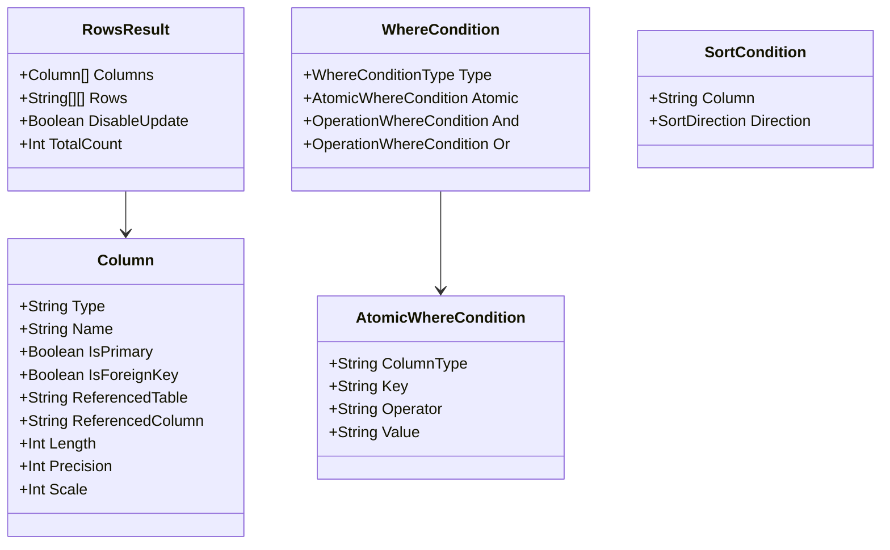
```mermaid
classDiagram
    class RowsResult {
        +Column[] Columns
        +String[][] Rows
        +Boolean DisableUpdate
        +Int TotalCount
    }

    class Column {
        +String Type
        +String Name
        +Boolean IsPrimary
        +Boolean IsForeignKey
        +String ReferencedTable
        +String ReferencedColumn
        +Int Length
        +Int Precision
        +Int Scale
    }

    class WhereCondition {
        +WhereConditionType Type
        +AtomicWhereCondition Atomic
        +OperationWhereCondition And
        +OperationWhereCondition Or
    }

    class AtomicWhereCondition {
        +String ColumnType
        +String Key
        +String Operator
        +String Value
    }

    class SortCondition {
        +String Column
        +SortDirection Direction
    }

    RowsResult --> Column
    WhereCondition --> AtomicWhereCondition
```

### 4.4 搜索与过滤

来源: `src/utils/search-parser.ts`, `src/components/database/TableDetailView.tsx`

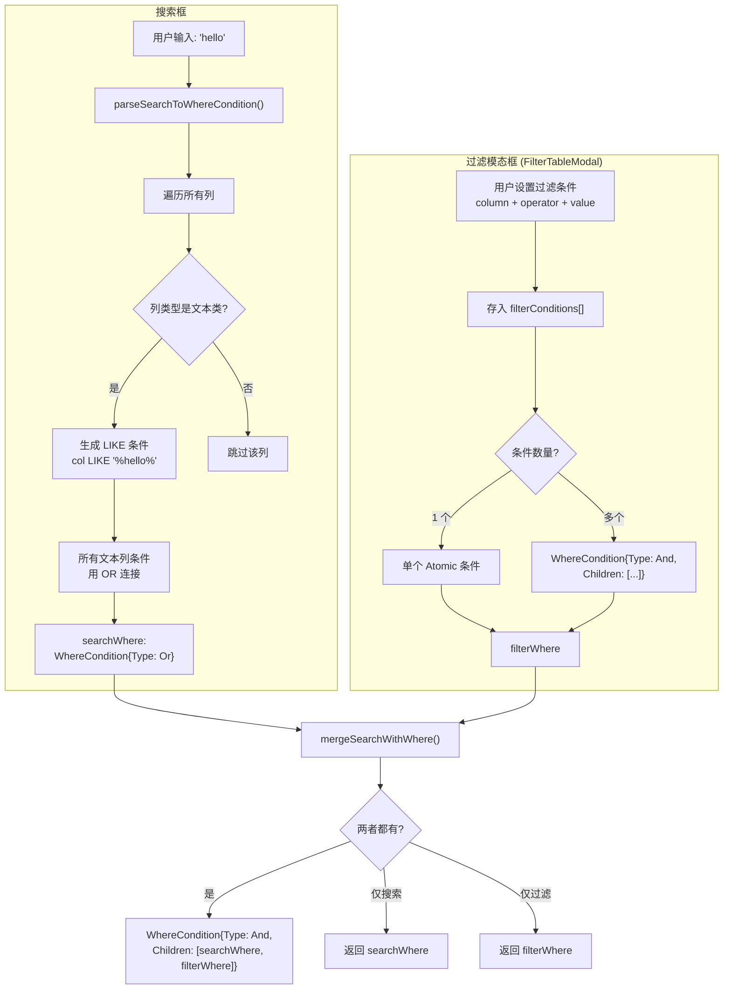
```mermaid
flowchart TD
    subgraph "搜索框"
        A["用户输入: 'hello'"] --> B["parseSearchToWhereCondition()"]
        B --> C["遍历所有列"]
        C --> D{"列类型是文本类?"}
        D -->|是| E["生成 LIKE 条件<br/>col LIKE '%hello%'"]
        D -->|否| F["跳过该列"]
        E --> G["所有文本列条件<br/>用 OR 连接"]
        G --> SW["searchWhere:<br/>WhereCondition{Type: Or}"]
    end

    subgraph "过滤模态框 (FilterTableModal)"
        H["用户设置过滤条件<br/>column + operator + value"] --> I["存入 filterConditions[]"]
        I --> J{"条件数量?"}
        J -->|"1 个"| K["单个 Atomic 条件"]
        J -->|"多个"| L["WhereCondition{Type: And,<br/>Children: [...]}"]
        K --> FW["filterWhere"]
        L --> FW
    end

    SW --> MERGE["mergeSearchWithWhere()"]
    FW --> MERGE

    MERGE --> R{"两者都有?"}
    R -->|是| S["WhereCondition{Type: And,<br/>Children: [searchWhere, filterWhere]}"]
    R -->|仅搜索| T["返回 searchWhere"]
    R -->|仅过滤| U["返回 filterWhere"]
```

#### WHERE 条件递归结构示例

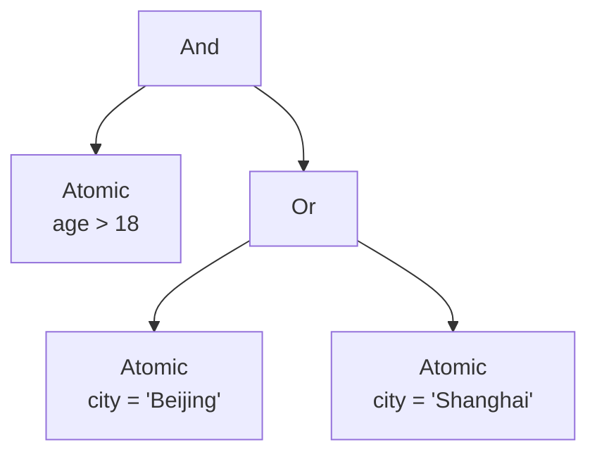
```mermaid
graph TD
    ROOT["And"] --> C1["Atomic<br/>age > 18"]
    ROOT --> C2["Or"]
    C2 --> C3["Atomic<br/>city = 'Beijing'"]
    C2 --> C4["Atomic<br/>city = 'Shanghai'"]
```

后端生成 SQL: `WHERE age > 18 AND (city = 'Beijing' OR city = 'Shanghai')`

### 4.5 排序

来源: `src/components/database/TableDetailView.tsx`

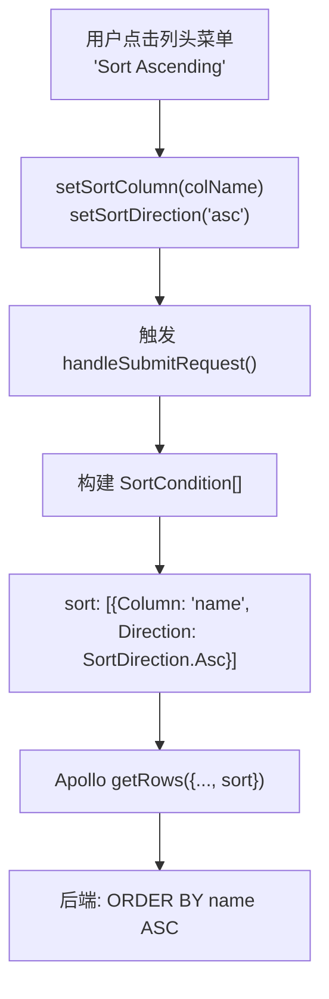
```mermaid
flowchart TD
    A["用户点击列头菜单<br/>'Sort Ascending'"] --> B["setSortColumn(colName)<br/>setSortDirection('asc')"]
    B --> C["触发 handleSubmitRequest()"]
    C --> D["构建 SortCondition[]"]
    D --> E["sort: [{Column: 'name', Direction: SortDirection.Asc}]"]
    E --> F["Apollo getRows({..., sort})"]
    F --> G["后端: ORDER BY name ASC"]
```

排序状态循环: 无排序 → ASC → DESC → 无排序

### 4.6 分页

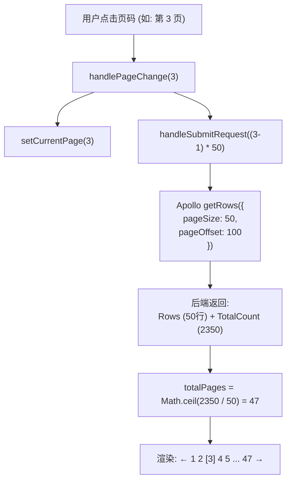
```mermaid
flowchart TD
    A["用户点击页码 (如: 第 3 页)"] --> B["handlePageChange(3)"]
    B --> C["setCurrentPage(3)"]
    B --> D["handleSubmitRequest((3-1) * 50)"]
    D --> E["Apollo getRows({<br/>pageSize: 50,<br/>pageOffset: 100<br/>})"]
    E --> F["后端返回:<br/>Rows (50行) + TotalCount (2350)"]
    F --> G["totalPages = Math.ceil(2350 / 50) = 47"]
    G --> H["渲染: ← 1 2 [3] 4 5 ... 47 →"]
```

### 4.7 CRUD 操作

#### 新增行

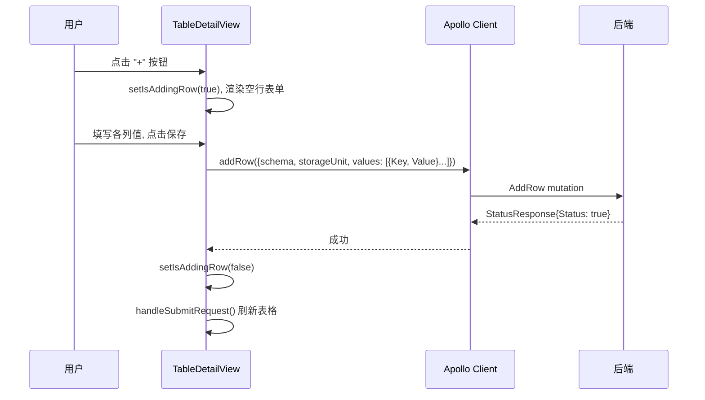
```mermaid
sequenceDiagram
    participant User as 用户
    participant TV as TableDetailView
    participant Apollo as Apollo Client
    participant API as 后端

    User->>TV: 点击 "+" 按钮
    TV->>TV: setIsAddingRow(true), 渲染空行表单
    User->>TV: 填写各列值, 点击保存
    TV->>Apollo: addRow({schema, storageUnit, values: [{Key, Value}...]})
    Apollo->>API: AddRow mutation
    API-->>Apollo: StatusResponse{Status: true}
    Apollo-->>TV: 成功
    TV->>TV: setIsAddingRow(false)
    TV->>TV: handleSubmitRequest() 刷新表格
```

#### 编辑行

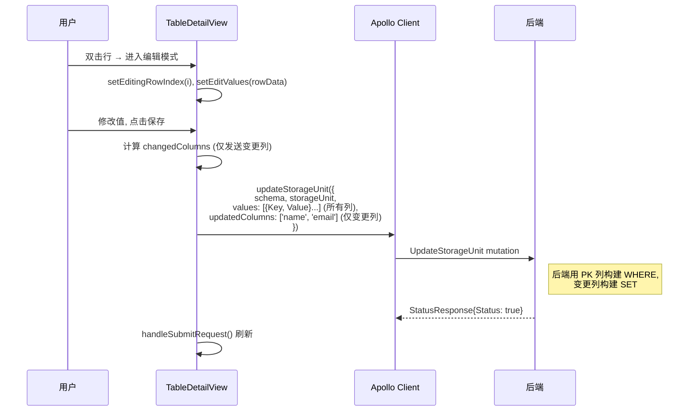
```mermaid
sequenceDiagram
    participant User as 用户
    participant TV as TableDetailView
    participant Apollo as Apollo Client
    participant API as 后端

    User->>TV: 双击行 → 进入编辑模式
    TV->>TV: setEditingRowIndex(i), setEditValues(rowData)
    User->>TV: 修改值, 点击保存
    TV->>TV: 计算 changedColumns (仅发送变更列)
    TV->>Apollo: updateStorageUnit({<br/>  schema, storageUnit,<br/>  values: [{Key, Value}...] (所有列),<br/>  updatedColumns: ['name', 'email'] (仅变更列)<br/>})
    Apollo->>API: UpdateStorageUnit mutation
    Note right of API: 后端用 PK 列构建 WHERE,<br/>变更列构建 SET
    API-->>Apollo: StatusResponse{Status: true}
    TV->>TV: handleSubmitRequest() 刷新
```

#### 删除行

```mermaid
sequenceDiagram
    participant User as 用户
    participant TV as TableDetailView
    participant Modal as ConfirmationModal
    participant Apollo as Apollo Client
    participant API as 后端

    User->>TV: 选择行, 点击删除
    TV->>Modal: 显示确认对话框
    User->>Modal: 确认删除
    Modal->>TV: onConfirm()
    TV->>Apollo: deleteRow({schema, storageUnit, values: [{Key, Value}...]})
    Apollo->>API: DeleteRow mutation
    API-->>Apollo: StatusResponse{Status: true}
    TV->>TV: handleSubmitRequest() 刷新
```

### 4.8 竞态条件防护

来源: `src/components/database/TableDetailView.tsx`

用户快速操作 (翻页/搜索) 可能导致旧请求的结果覆盖新请求。通过 `latestRequestIdRef` 计数器解决：

```mermaid
sequenceDiagram
    participant User as 用户
    participant TV as TableDetailView
    participant Ref as latestRequestIdRef

    User->>TV: 翻到第 2 页
    TV->>Ref: ref = 1
    TV->>TV: 发送请求 A (thisRequestId=1)

    User->>TV: 快速翻到第 3 页
    TV->>Ref: ref = 2
    TV->>TV: 发送请求 B (thisRequestId=2)

    Note over TV: 请求 A 先返回 (第 2 页数据)
    TV->>TV: 1 !== ref(2) → 丢弃

    Note over TV: 请求 B 返回 (第 3 页数据)
    TV->>TV: 2 === ref(2) → setData() ✓
```

其他防护措施:
- `filterConditionsRef`: 用 `useRef` 保持过滤条件引用稳定，避免闭包捕获过期值
- `columnsRef`: 保留最新列信息，在 `data=null` (加载中) 时仍可用于搜索条件构建
- 表切换时 (`lastTableRef`) 重置所有状态

### 4.9 表格渲染

来源: `src/components/database/TableDetailView.tsx`

```mermaid
flowchart TD
    A["TableDetailView 渲染"]

    subgraph "工具栏"
        A --> T1["搜索框<br/>(searchTerm → handleSubmitRequest)"]
        A --> T2["过滤按钮<br/>→ FilterTableModal"]
        A --> T3["刷新按钮<br/>(refreshKey += 1)"]
        A --> T4["导出按钮<br/>→ ExportDataModal"]
        A --> T5["添加行按钮<br/>(isAddingRow = true)"]
    end

    subgraph "表头"
        A --> H1["列名"]
        H1 --> H2["PK 图标 (KeyIcon)"]
        H1 --> H3["FK 图标 (ShareIcon)"]
        H1 --> H4["类型标签 (简化显示)"]
        H1 --> H5["列菜单 (排序/隐藏)"]
        H1 --> H6["拖拽调整列宽"]
    end

    subgraph "表体"
        A --> B1["数据行"]
        B1 --> B2["选中行高亮"]
        B1 --> B3["双击 → 编辑模式"]
        B1 --> B4["列值截断 + Tooltip"]
    end

    subgraph "底栏"
        A --> P1["分页导航<br/>← 1 2 [3] 4 5 →"]
        A --> P2["每页行数选择"]
        A --> P3["总行数显示"]
    end
```

#### 类型标签简化

```typescript
const simplifyColumnType = (typeStr: string): string => {
  return typeStr
    .replace(/ varying/gi, '')         // "character varying" → "character"
    .replace(/ without time zone/gi, '')
    .replace(/ with time zone/gi, ' tz')
    .replace(/character/gi, 'char')    // "character" → "char"
    .replace(/double precision/gi, 'double')
    .trim();
};
```

### 4.10 数据转换

来源: `src/utils/graphql-transforms.ts`

```mermaid
flowchart LR
    A["GraphQL RowsResult"] --> B["transformRowsResult()"]
    B --> C["TableData"]

    subgraph "TableData"
        D["columns: string[]<br/>(列名数组)"]
        E["columnTypes: Record<string, string><br/>(列名→类型映射)"]
        F["rows: Record<string, any>[]<br/>(行数据对象数组)"]
        G["primaryKey: string | null"]
        H["foreignKeyColumns: string[]"]
        I["totalCount: number"]
        J["disableUpdate: boolean"]
    end
```

### 4.11 后端处理 (简述)

后端 Row Resolver 收到前端请求后：
1. 并行执行 `GetRows` (数据查询) 和 `GetColumnsForTable` (列元数据)
2. `GetRows` 内部并行执行数据查询 (LIMIT/OFFSET) 和 COUNT 查询
3. 通过 `ApplyWhereConditions()` 递归处理 `Atomic`/`And`/`Or` 条件
4. 所有值转为字符串返回 (`String[][]`)，前端负责显示格式化

---

## 5. 关键文件索引

### 配置层

| 文件 | 职责 |
|------|------|
| `src/config/graphql-client.ts` | Apollo Client: errorLink → authLink → httpLink |
| `src/config/auth-store.ts` | 模块级凭据存储 + sessionStorage 持久化 |
| `src/config/auth-headers.ts` | Bearer token 构建, 支持 databaseOverride |
| `src/config/sealos.ts` | Sealos 集成: 类型映射, AES-256-CBC 解密 |

### 状态层

| 文件 | 职责 |
|------|------|
| `src/stores/useAuthStore.ts` | 认证生命周期 (Sealos 登录 / session 恢复) |
| `src/stores/useConnectionStore.ts` | 连接派生, fetchDatabases/Schemas/Tables |
| `src/stores/useTabStore.ts` | Tab 生命周期 (打开/关闭/切换/去重) |
| `src/stores/useAnalysisStore.ts` | 仪表盘状态 (内存, 无持久化) |

### 组件层

| 文件 | 职责 |
|------|------|
| `src/components/database/TableDetailView.tsx` | 数据表视图主组件 (CRUD, 分页, 搜索, 过滤) |
| `src/components/database/FilterTableModal.tsx` | 过滤条件编辑模态框 |
| `src/components/database/ExportDataModal.tsx` | 数据导出 (CSV/Excel) |
| `src/components/layout/MainLayout.tsx` | 主布局容器 |
| `src/components/layout/Sidebar.tsx` | 左侧树形浏览器 |
| `src/components/layout/TabBar.tsx` | 标签栏 |

### 工具层

| 文件 | 职责 |
|------|------|
| `src/utils/search-parser.ts` | 搜索文本 → WhereCondition 转换 |
| `src/utils/graphql-transforms.ts` | RowsResult → TableData 转换 |
| `src/utils/database-features.ts` | 数据库类型特性判断 (resolveSchemaParam, isNoSQL) |

### GraphQL 定义

| 目录 | 内容 |
|------|------|
| `src/graphql/queries/` | .graphql 查询文件 |
| `src/graphql/mutations/` | .graphql mutation 文件 |
| `src/generated/` | codegen 自动生成的类型和 hooks |
